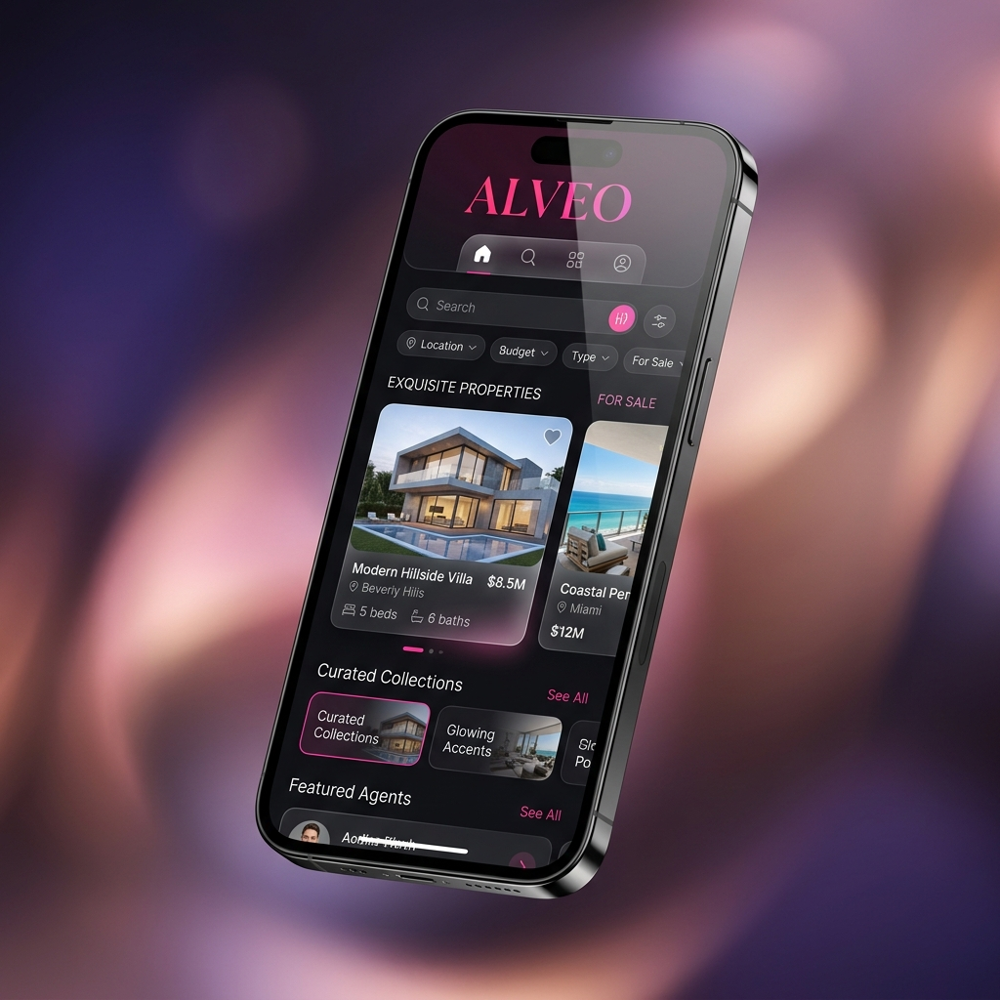
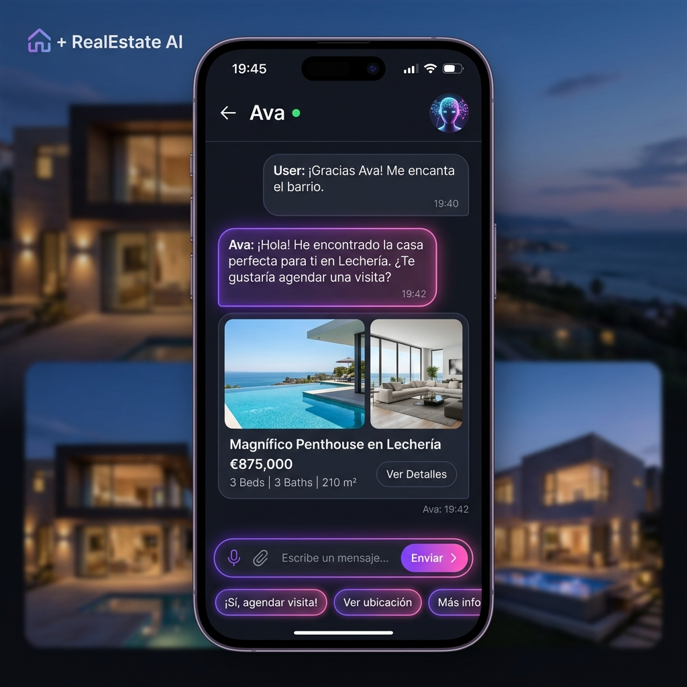
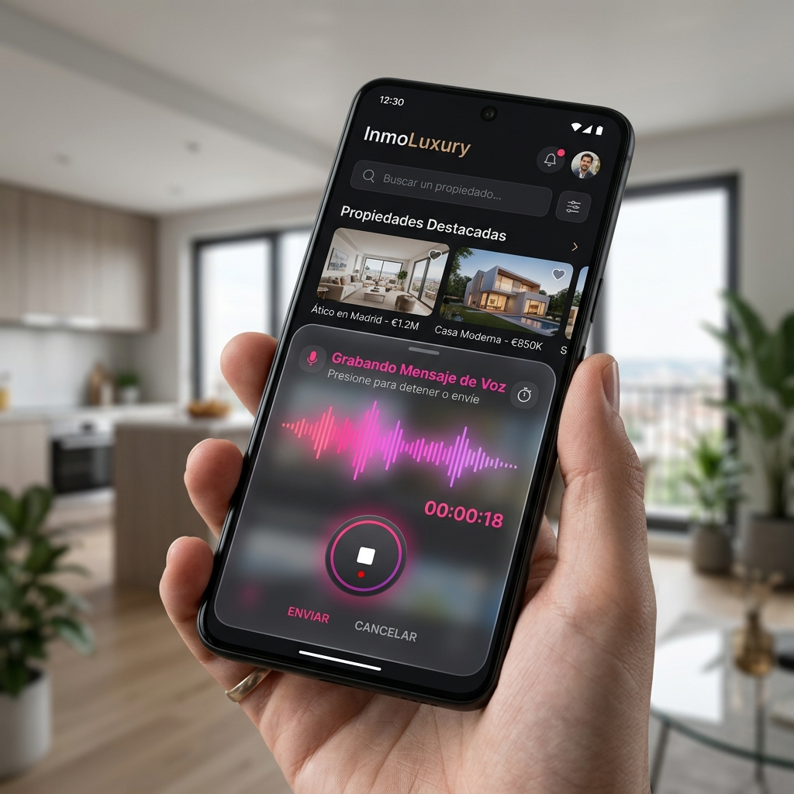
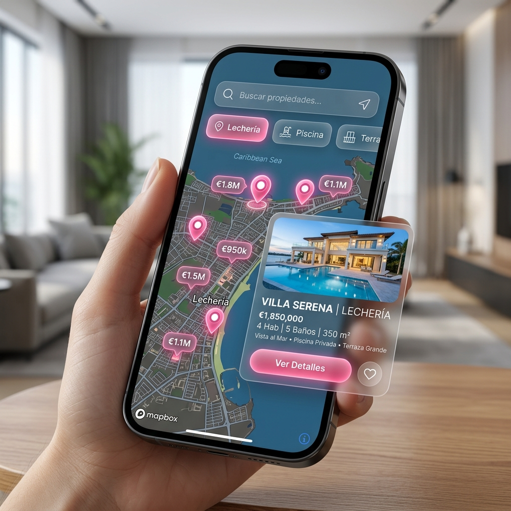
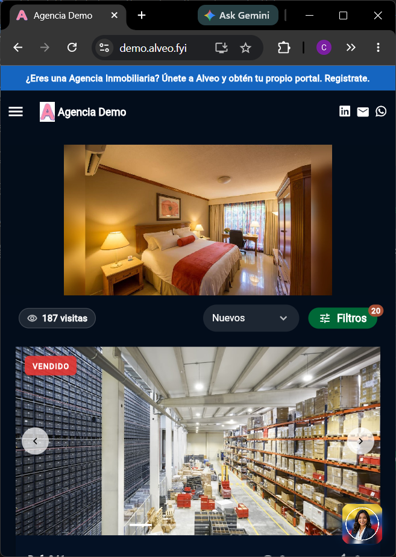
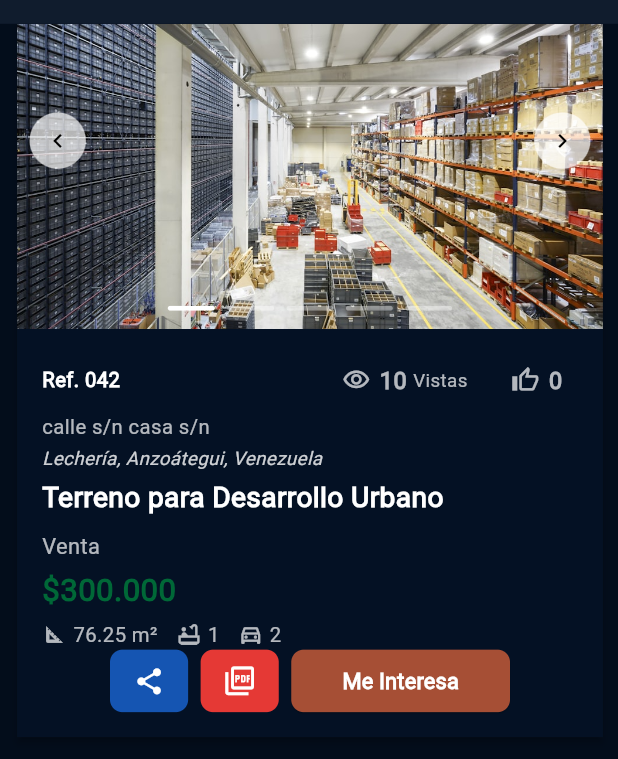
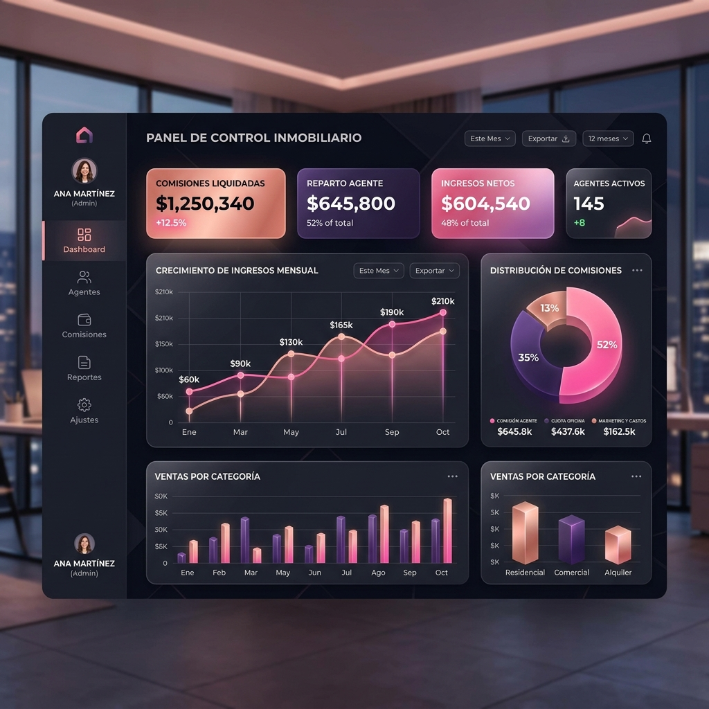
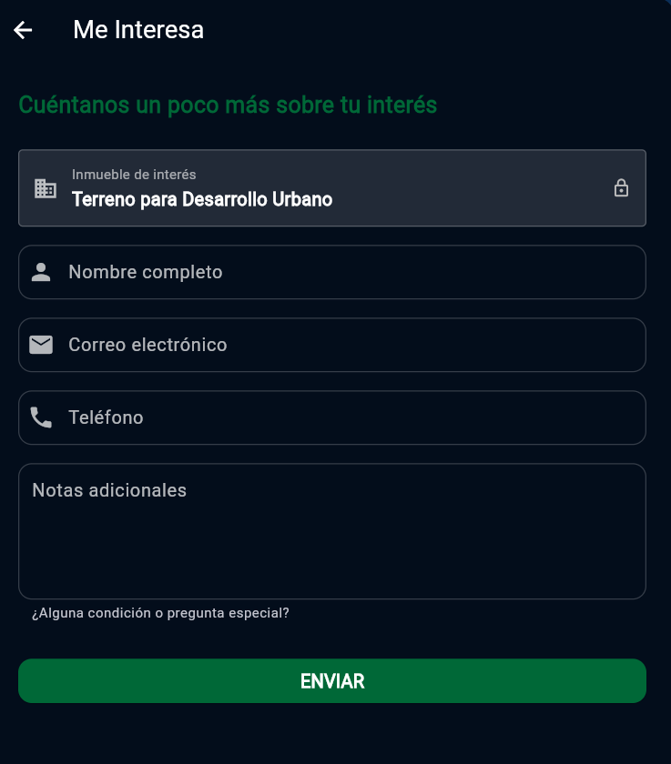
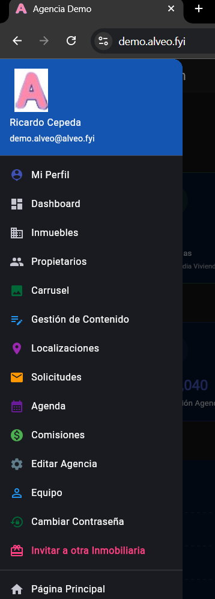
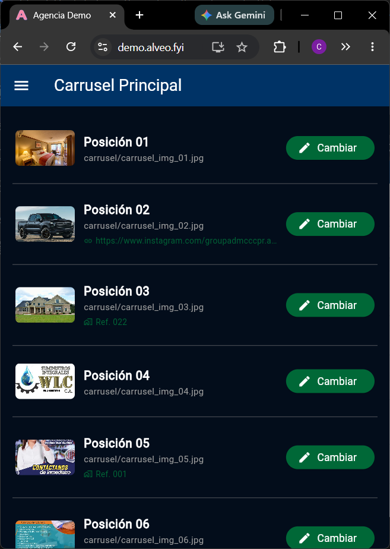

# Dossier de Producto: Alveo — Asistente Inmobiliario

Esta es una presentación comercial y técnica detallada y de alto impacto sobre el ecosistema de **Alveo: Asistente Inmobiliario**, presentando sus capturas reales actualizadas, su valor de mercado, la experiencia de usuario (UI/UX) inmersiva con la Agente de IA Ava y todos sus módulos avanzados en español.

---

````carousel
# Diapositiva 1: Portada y Ecosistema de Negocio



## Alveo — Asistente Inmobiliario
*La redefinición digital de los bienes raíces a través de Inteligencia Artificial y automatización inteligente.*

Alveo no es solo una página web; es un ecosistema de **Software como Servicio (SaaS)** modular que actúa como un **copiloto activo** para agencias inmobiliarias, corredores independientes y clientes compradores.

* **Ava (Agente de IA)**: Tu canal de ventas automatizado 24/7.
* **Portal de Catálogo**: Un escaparate digital de primera clase, responsivo y adaptado para dispositivos móviles.
* **Suite de Administración**: Herramientas financieras de comisiones, gestor de clientes (CRM), calendario y mapas.

<!-- slide -->

# Diapositiva 2: La Agente Cognitiva de IA (Ava)



## Ava: Inteligencia Conversacional Humana
Ava trasciende a los asistentes virtuales tradicionales basados en flujos de botones rígidos, ofreciendo una experiencia conversacional 100% natural.

* **Conversación Fluida y Multi-Idioma**: Capacidad para dialogar de manera nativa en español o inglés, adaptándose al idioma del cliente en caliente.
* **Memoria Contextual Activa**: Retiene hasta 10 turnos de conversación previos de forma fluida. Si el usuario dice *"búscame una casa"* y luego añade *"que tenga piscina y sea en Anaco"*, Ava recuerda que el tipo de inmueble es una casa y mantiene el hilo de forma coherente.
* **Entrada de Voz Multimodal**: Los clientes pueden enviarle notas de voz cortas. Ava procesa el archivo de audio, lo transcribe y genera una respuesta semántica con enlaces interactivos.

<!-- slide -->

# Diapositiva 3: Experiencia de Usuario Inmersiva (Micrófono Inteligente)



## Ingeniería de Privacidad y Diseño de Primera
La experiencia de chatear con Ava está pulida con altos estándares de usabilidad:

* **Activación Transitoria del Usuario (Transient User Activation)**:
  Para evitar que los navegadores web modernos bloqueen silenciosamente el micrófono de los clientes, diseñamos un flujo de eventos directo. La validación de permisos y el inicio de la grabación se ejecutan estrictamente dentro del evento de clic del botón de micrófono, preservando la cadena de gesto del usuario para mostrar la ventana flotante nativa del navegador.
* **Interfaz Estética Premium**:
  * Botón flotante animado con descripciones contextuales.
  * Interfaz de chat en un panel inferior deslizable (*BottomSheet*) de vidrio esmerilado.
  * Ondas de audio animadas que laten visualmente mientras Ava "escucha".
  * Transición fluida a Modo Oscuro y Modo Claro.

<!-- slide -->

# Diapositiva 4: Mapeo y Búsqueda Profunda (Búsqueda SQL en Supabase)



## Búsqueda Cruzada en la Nube de Supabase
Ava tiene la capacidad cognitiva de traducir el lenguaje coloquial en búsquedas estructuradas en tu base de datos:

* **Mapeo de Comodidades**:
  Asocia intenciones semánticas a las columnas de la tabla de detalles del inmueble:
  * *"local con luz y agua en obra gris"* ➔ `has_electricity = true`, `has_water_connections = true`, `delivery_status = 'Obra gris'`
  * *"casa amoblada con terraza y piscina"* ➔ `is_furnished = true`, `has_terrace = true`, `has_pool = true`
* **Búsqueda de Texto Completo (FTS)**:
  Si el cliente describe un concepto libre (*"frente al mar"*, *"cerca del colegio"*), la IA invoca un parámetro de búsqueda que realiza una consulta de texto cruzada con operadores `OR` de Supabase sobre el título, descripción y dirección de las propiedades.

<!-- slide -->

# Diapositiva 5: Gestión Premium de Contenidos y Catálogo





## Tu Inventario Inmobiliario de Alto Nivel
Alveo expone tus propiedades con la máxima calidad y precisión del mercado:

* **Asignación Geográfica con Mapas Interactivos**: Integración de mapas de alta fluidez para marcar ubicaciones exactas y realizar geolocalización inversa de direcciones físicas.
* **Gestor de Galería Fotográfica**: Subida directa de múltiples imágenes con reordenación intuitiva y capacidad de seleccionar con un clic la **Foto Principal** del inmueble.
* **Filtros Avanzados para Clientes**: Filtros rápidos con opciones predictivas de búsqueda en la ciudad activa para acelerar la conversión.

<!-- slide -->

# Diapositiva 6: Módulo Financiero de Comisiones y Reparto



## Gestión Financiera de Comisiones y Facturación
Alveo incorpora un panel administrativo para liquidar comisiones y transacciones inmobiliarias de manera 100% automatizada:

* **Repartos Dinámicos**: Cálculo automático del porcentaje de comisiones entre los agentes captadores, cerradores, corredores independientes y la agencia.
* **Generación de Reportes**:
  * Exportación de historiales de cobros directamente a plantillas de **Excel**.
  * Generación de **Recibos de Pago PDF** listos para imprimir para los agentes.
  * Generación de **Facturas de Comisión PDF** para los propietarios.
* **Seguridad de Cobros**: Al validar un cierre de venta/alquiler, el inmueble se marca como "Reservado/Vendido" y se registra el flujo de caja en el historial.

<!-- slide -->

# Diapositiva 7: CRM de Solicitudes y Agenda Digital



## El Corazón del Flujo de Trabajo del Corredor
Mantén a tu equipo de agentes sincronizado y con control absoluto sobre las oportunidades de venta:

* **Integración Nactiva de la Agente Ava (CRUD y Consulta)**:
  * **Agendar y Calificar**: Ava registra la solicitud en el CRM y la cita en la Agenda, cambiando el lead a "Respondida" para reflejar la atención activa.
  * **Consultar, Confirmar, Reprogramar y Cancelar**: El cliente puede pedirle a Ava consultar sus citas, confirmarlas, reprogramarlas o cancelarlas. Ava valida horarios en caliente, resuelve colisiones sugiriendo horas libres del día y ejecuta los cambios.
  * **Finalizar (`done`)**: Los agentes y administradores pueden pedirle a Ava marcar la cita como realizada de forma 100% manos libres.
* **Notificaciones por Correo de Actualización**:
  * Cualquier cambio de estado de cita (confirmada, reprogramada, cancelada o realizada) gatilla un **correo de alerta al agente asignado** en tiempo real.
* **Integridad del CRM y Agenda (Eliminaciones Seguras)**:
  * Si un agente elimina manualmente una cita de un prospecto real en el calendario, el sistema desvincula la cita y **restaura el lead a "Pendiente"** en el CRM, previniendo la pérdida de oportunidades comerciales.

<!-- slide -->

# Diapositiva 8: Configuración Regional & Marca Blanca



## Tu Marca, Tus Reglas de Negocio
Alveo se adapta a la perfección a la identidad de tu inmobiliaria en cualquier país del mundo:

* **Manual de Marca Blanca**:
  * Carga personalizada de **Logotipo Completo** para pantallas de PC y **Logotipo Abreviado** para pantallas de teléfonos.
  * Configuración directa de enlaces de redes sociales (Instagram, Facebook, Telegram) y WhatsApp de la empresa.
* **Configuración Regional**:
  * Conversión de unidades de superficie: **Metros Cuadrados (m²)** o **Pies Cuadrados (ft²)**.
  * Ajustes de moneda local y tasas impositivas configurables según la legislación tributaria de tu país (ej. impuestos para personas jurídicas).

<!-- slide -->

# Diapositiva 9: Gamificación y Crecimiento de Red



## Estrategia de Crecimiento Colaborativo Integrado
Alveo posee herramientas diseñadas para viralizar la suscripción de agencias y capturar talento:

* **Campaña de Referidos por Capacidad**:
  Si una inmobiliaria llega al límite de inmuebles de su plan de pruebas, puede invitar a otros corredores mediante su enlace personal. Al concretarse el registro del colega, la plataforma recompensa de forma automatizada a la agencia promotora otorgándole **+2 cupos adicionales de inventario** de por vida.
* **Corredores y Ejecutivos Freelance**:
  Módulo de comisiones regionalizado para ejecutivos de ventas afiliados que promueven la adopción del portal.

<!-- slide -->

# Diapositiva 10: Infraestructura y Seguridad de Datos


## Confiabilidad y Privacidad en la Nube

```
┌──────────────────────────────────────────────────────────────┐
│                     CLIENTE FLUTTER WEB                      │
│     Interfaz Estética Premium / Vidrio Esmerilado / Móvil    │
└──────────────────────────────┬───────────────────────────────┘
                               │ (Conexión Segura HTTPS)
                               ▼
┌──────────────────────────────────────────────────────────────┐
│                    SUPABASE EDGE FUNCTION                    │
│      Servidor Deno / Validación JWT / Listo para CORS        │
└──────────────────────────────┬───────────────────────────────┘
                               │
               ┌───────────────┴───────────────┐
               ▼ (Seguridad RLS Activa)        ▼ (Clave de API Segura)
┌──────────────────────────────┐┌──────────────────────────────┐
│      BASE DE DATOS           ││      API DE GEMINI FLASH     │
│ PostgreSQL / Comisiones/     ││ Privacidad de Datos de Pago  │
│ Propiedades / Detalles       ││ Sin entrenamiento público    │
└──────────────────────────────┘└──────────────────────────────┘
```

* **Seguridad a Nivel de Fila (Row Level Security - RLS)**: Aislamiento total de los datos. Ninguna agencia puede ver o consultar propiedades, comisiones o clientes de otra empresa.
* **Privacidad Contratada de IA**: Google garantiza contractualmente que los chats de tus clientes y tus datos inmobiliarios jamás serán usados para entrenar a sus modelos de lenguaje públicos.
* **Base de Datos Postgres de Altísima Velocidad** alojada en la nube de Supabase.
````
